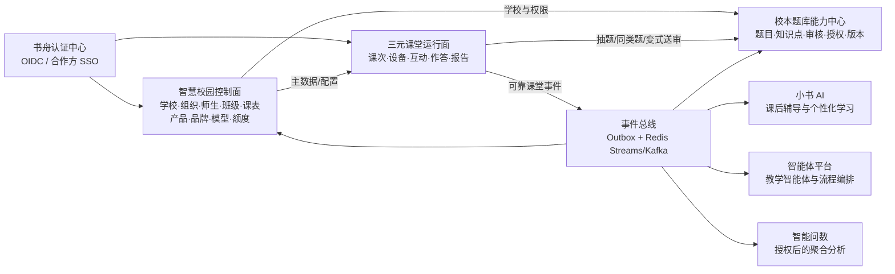

# 三元课堂 SaaS 产品与跨产品联动改造方案

> 版本：v1.0（2026-07-23）  
> 评估基线：`ba2d246a4353394de0a60fbc79f4ab389a46b006`  
> Demo 归档标签：`demo-v1-archive-20260723`

## 1. 核心结论

三元课堂不应该继续扩成一个同时管理学校、用户、题库、模型和报表的独立大系统。目标产品应按以下边界建设：

1. **智慧校园是控制面**：学校、租户、组织、师生、班级、任课关系、学期课表、产品订阅、学校品牌、模型、额度和合作方授权都由智慧校园管理。
2. **三元课堂是课堂运行面**：负责课次、课堂会话、设备、签到、互动、活动、作答、批改、课堂原始数据和课堂报告。
3. **校本题库是内容权威源**：题目正文、版本、知识点、难度、审核、版权和题库授权归 `xbtk`；三元课堂只保存来源引用和开课时的不可变快照。
4. **书舟认证是统一身份入口**：用户永久身份使用 `(issuer, membership_id)`，手机号只用于第一次归并，不能作为长期主键。
5. **事件总线承接产品联动**：课堂事务先可靠落库，再通过 Outbox 发布标准事件；智慧校园、题库、小书 AI、智能体和智能问数按权限消费。
6. **Demo 与 SaaS 分轨维护**：Demo 标签保持可演示；SaaS 改造从新分支和正式迁移开始，不在演示配置上直接堆补丁。

## 2. 当前代码事实

| 领域 | 当前实现 | SaaS 缺口 |
|---|---|---|
| 实时课堂 | `classroom.gateway.ts` 维护约 70 个事件 | 课堂状态主要在单进程 `Map`，无法多实例、恢复和审计 |
| 课堂题目 | `TaskEntity.questions` 为 JSON | 无题库来源、题目版本、租户边界和不可变快照规范 |
| 学生身份 | 本地随机身份或固定 Demo 身份 | 未与书舟 `membership_id`、智慧校园学生档案稳定绑定 |
| 课堂学情 | Gateway 内存聚合，部分写入本地错题表 | 结课后不可可靠重算，未回流智慧校园 |
| 管理端 | 登录、监控有部分真实接口 | 班级、课程、用户、报表、AI 治理仍有大量 mock |
| 校本题库 | 已有知识点、难度、题型、审核、授权、相似题、组卷 | 缺课堂专用服务 API、题目修订版本和课堂效果回传 |
| 智慧校园 | 已有学校、班级、学生、教师、任课、产品和模型配置 | 缺三元课堂产品配置及课堂学情投影 |
| 认证 | 三元课堂自有 JWT/可关闭 WS 鉴权 | 未接书舟 OIDC，未严格校验产品 audience 和学校授权 |
| AI | 支持多模型和客户端传模型地址/Key | 配置权下放给客户端，存在 SSRF、密钥和额度治理风险 |

当前代码可以继续用于 Demo，但不应直接作为生产安全基线。

## 3. 目标系统边界



### 3.1 数据所有权

| 数据 | 权威系统 | 其他系统的处理方式 |
|---|---|---|
| 学校、租户、学期、组织 | 智慧校园 | 只读同步或按 ID 引用 |
| 教师、学生、班级、任课关系 | 智慧校园 | 三元课堂保存课次名单快照，不反向修改主档 |
| 登录身份和合作方绑定 | 书舟认证 | 产品保存 `issuer + membership_id` 映射 |
| 题目、知识点、题库、审核和版权 | 校本题库 | 三元课堂保存题目引用和发布时快照 |
| 课堂原始活动和作答 | 三元课堂 | 通过事件输出，其他产品不直接写课堂库 |
| 校级/年级/班级学情投影 | 智慧校园分析层 | 可从课堂事件重建 |
| AI 模型、场景路由、额度 | 智慧校园 | 三元课堂只传 `usage_scene`，不接收客户端 Key |

## 4. 统一身份和多租户规则

### 4.1 身份键

- 永久登录身份：`(issuer, membership_id)`。
- 数据边界：`school_id + tenant_id`，所有事务表必填并建立复合索引。
- 业务人物引用：教师使用 `edu_teacher_id`，学生使用 `edu_student_id`。
- `legacy_user_id` 仅用于兼容现有系统，不作为新表跨产品主键。
- 手机号只允许在首次绑定时作为候选匹配条件，匹配后固化 membership，不允许每次登录按手机号重查。
- 一个手机号存在多学校、多角色或家庭共用时，必须由用户确认或管理员处理，禁止静默合并。

建议在智慧校园建立统一人物绑定表，而不是让每个产品各做一套手机号归并：

```text
edu_identity_binding
- binding_id
- issuer
- membership_id
- school_id
- tenant_id
- person_type: teacher | student | parent | staff
- person_id: edu_teacher_id / edu_student_id / ...
- bind_source: campus | partner | phone_match | admin
- verified_at
- status
UNIQUE (issuer, membership_id, school_id)
```

### 4.2 三元课堂登录

- 注册 OIDC client：`shuzhou-classroom`。
- 智慧校园应用编码：`sanyuan-classroom`。
- Web/H5 使用 Authorization Code + PKCE；原生 App 使用系统浏览器完成同一流程。
- 后端必须验证 RS256、`iss`、`aud=shuzhou-classroom`、`exp`、`token_use` 和学校订阅。
- WebSocket 握手必须携带短期 access token；`WS_AUTH_MODE=off` 只允许 Demo 环境。
- 合作方进入三元课堂时复用现有 partner grant 模型，授权范围至少包含产品、学校、角色和有效期。

## 5. 校本题库与课堂出题闭环

### 5.1 基本原则

1. 课堂**引用题目，不复制题库主记录**。
2. 活动发布时必须保存题目快照，保证题库后来修改后仍能重放当堂内容和评分口径。
3. 学生端永远只收到不含答案和解析的投影；答案只保留在服务端评分上下文中。
4. 所有抽题都由服务端执行，前端不能指定任意 `school_id` 越权读取。
5. 题目是否可用同时受本校归属、平台授权、发布状态、学科、年级和内容策略约束。

### 5.2 课堂抽题场景

#### 场景 A：老师主动选题

老师按课程自动带出 `subject_id`、年级和当前教学知识点，再选择：

- 校本题库、已授权官方题库或教材图书；
- 题型、难度、知识点、章节、标签；
- 全班同题、随机抽题或分层抽题；
- 题数、限时和分值。

现有 `xbtk` 的 `QuestionQuery`、`FindSimilarByQuestion` 和 `PaperAgentService.AutoGenerate` 可以作为内核，但应增加稳定的课堂专用 API，避免直接复用教师管理端接口。

#### 场景 B：课堂动态补题

一次答题结束后，根据实时正确率执行建议：

- 正确率低于阈值：抽取同知识点、更低难度题进行巩固；
- 正确率中等：抽取同知识点、同难度不同情境题；
- 正确率高：抽取相邻知识点或更高难度迁移题；
- 学生差异明显：按掌握度生成 A/B/C 分层题包。

系统只给老师建议和预览，默认不得自动向学生推题。

#### 场景 C：举一反三

“举一反三”应分两级处理：

1. **优先检索**：先调用题库相似题接口，按知识点命中、题型、难度和历史使用去重选取已有题。这类题已审核，风险最低。
2. **AI 变式**：题库没有合适题时，以母题的结构化信息生成变式，要求知识点不变、数值/情境变化、答案唯一、解析完整。

AI 变式状态：

```text
generated -> teacher_previewed -> classroom_only
                              -> submitted_for_review -> approved -> reusable
                                                    -> rejected
```

- 未审核变式只能在本次课堂临时使用，并清晰标记 AI 生成。
- 老师修改后仍须重新经过结构校验和答案一致性校验。
- 进入校本题库必须提交审核，保留母题 `trace_uid`、提示词模板版本、模型调用记录和修改历史。
- 涉及图片、公式、复合题时，需要渲染检查，不允许把未经处理的 HTML 直接下发学生端。

### 5.3 题目版本与快照

现有 `tk_question.trace_uid` 可作为稳定业务 ID，但还缺内容修订号。建议题库增加：

```text
tk_question_revision
- revision_id
- question_id
- trace_uid
- revision_no
- content_hash
- snapshot_json
- change_reason
- review_status
- effective_at
- created_by
UNIQUE (question_id, revision_no)
```

三元课堂活动题目保存：

```text
classroom_activity_question
- id
- school_id / tenant_id
- activity_id
- source_type: question_bank | ai_variant | manual
- source_question_id
- source_trace_uid
- source_revision_no
- source_content_hash
- snapshot_json
- student_projection_json
- answer_key_encrypted
- knowledge_point_ids
- points
- display_order
```

### 5.4 题库内部 API 建议

| API | 用途 |
|---|---|
| `POST /internal/v1/classroom/questions/search` | 课堂选题筛选，返回可用题摘要 |
| `POST /internal/v1/classroom/questions/sample` | 按题型/难度/知识点配额服务端抽题 |
| `POST /internal/v1/classroom/questions/{trace_uid}/similar` | 从母题检索同类题 |
| `GET /internal/v1/classroom/questions/{trace_uid}/revision/{no}` | 获取指定修订快照 |
| `POST /internal/v1/classroom/variants` | 创建课堂临时 AI 变式 |
| `POST /internal/v1/classroom/variants/{id}/submit-review` | 将变式送入校本题库审核 |

内部接口必须使用服务身份和最小 scope，例如 `question.read`、`question.sample`、`question.variant.create`；不能长期复用教师浏览器 token。当前书舟认证仅支持授权码模式，生产前应增加受限的 `client_credentials`，或先由统一内部网关签发短期服务 JWT。

## 6. 三元课堂核心数据模型

正式表建议使用 `classroom_` 前缀，禁止继续依赖 TypeORM `synchronize=true` 自动改生产库。

| 表 | 作用 |
|---|---|
| `classroom_course` | 三元课堂课程实例，引用智慧校园学期、学科、教师和班级 |
| `classroom_lesson_session` | 一次真实课次，包含计划时间、实际时间、教室和状态 |
| `classroom_roster_snapshot` | 开课时学生名单快照，避免班级后续调整破坏历史 |
| `classroom_device_binding` | 教师平板、学生平板、大屏与学校/教室绑定 |
| `classroom_activity` | 测验、投票、讨论、抢答、签到等统一活动主表 |
| `classroom_activity_question` | 题目来源、版本、快照、分值和答案安全存储 |
| `classroom_submission` | 学生对活动的一次提交 |
| `classroom_answer` | 单题作答、评分、是否正确、批改来源和反馈 |
| `classroom_attendance` | 签到事实及校验结果 |
| `classroom_report` | 规则指标、AI 文本报告、模型版本和审核状态 |
| `classroom_event_outbox` | 与业务事务同库写入的待发布事件 |
| `classroom_audit_log` | 管理、导出、AI 调用和敏感数据访问审计 |

每张事务表至少包含：

```text
id, school_id, tenant_id, created_at, updated_at
```

涉及人的事实表还应保存：

```text
issuer, membership_id, person_type, person_id
```

### 6.1 实时状态

- MySQL/PostgreSQL：课堂业务事实的权威存储。
- Redis：在线成员、房间租约、短期计时器、分布式锁和 Socket.IO adapter。
- Redis Streams/BullMQ：批改、报告、资源转换和事件投递任务。
- OSS/MinIO：课件、图片、音视频和报告附件。
- 进程内 Map 只保留连接级缓存，任何关键状态必须能从 DB + Redis 恢复。

## 7. 学情回流智慧校园

### 7.1 标准事件信封

```json
{
  "event_id": "01J...",
  "event_type": "classroom.activity.completed.v1",
  "schema_version": 1,
  "occurred_at": "2026-07-23T07:30:00Z",
  "producer": "sanyuan-classroom",
  "trace_id": "...",
  "school_id": 53,
  "tenant_id": "100026",
  "lesson_session_id": "...",
  "actor": {
    "issuer": "https://auth.longdao.top",
    "membership_id": "...",
    "role": "teacher"
  },
  "payload": {}
}
```

消费者以 `event_id` 做幂等；生产者采用 Outbox，只有课堂事务提交成功后才能发布。事件升级采用新版本，不在原字段上偷偷改变语义。

### 7.2 第一批事件

| 事件 | 主要消费者 |
|---|---|
| `classroom.lesson.started.v1` | 智慧校园实时监管、设备运维 |
| `classroom.attendance.completed.v1` | 智慧校园考勤投影 |
| `classroom.activity.published.v1` | 审计、实时监管 |
| `classroom.activity.completed.v1` | 学情服务、题库效果统计 |
| `classroom.student.mastery.updated.v1` | 小书 AI、学业预警、学生画像 |
| `classroom.question.usage.v1` | 校本题库质量和难度校准 |
| `classroom.lesson.ended.v1` | 智慧校园课堂台账 |
| `classroom.report.ready.v1` | 管理端、教师端、智能体 |

### 7.3 回流指标

智慧校园不应只接收一段 AI 总结，而应接收可重算的结构化指标：

- 到课率、迟到率、异常退出；
- 互动参与率、举手/讨论/抢答参与；
- 活动提交率、平均分、分位数、优秀率、低分率；
- 题目正确率、区分度、平均作答时长、选项分布；
- 班级/学生/知识点掌握度和置信度；
- AI 批改占比、人工复核率和复核差异；
- 设备在线率、断线次数和课堂异常。

原始答案和学生姓名属于敏感数据，不进入通用报表事件；需要明细时由有权限的管理端通过受审计 API 查询。

### 7.4 智慧校园管理端视图

- 平台总控：学校开通、在线课堂数、服务健康、模型消耗、告警和审计。
- 校级总览：今日课次、到课率、互动率、课堂质量趋势和待处理异常。
- 年级/班级：知识点薄弱分布、班级对比、学科趋势。
- 教师视图：本人课堂报告、题目使用效果和待复核 AI 批改。
- 学生视图：个人掌握度、错题、补救任务；严格按角色和数据范围授权。

“课堂质量”不能只由单一 AI 分数决定。规则指标与 AI 建议必须分栏展示，AI 结论保留模型、提示词版本和证据来源，并允许教师申诉或修订。

## 8. 与其他产品的联动

### 8.1 小书 AI

- 结课后读取学生薄弱知识点和经授权的错题快照，生成个性化讲解和练习路径。
- 推荐题仍优先来自校本题库；AI 生成题沿用同一审核与溯源规则。
- 学生完成课后辅导后发布学习结果事件，回写智慧校园画像，不直接篡改课堂原始成绩。

### 8.2 智能体平台

可配置以下学校级智能体：

- 课前备课智能体：结合课程、教材、知识点和历史学情生成课堂活动草案。
- 课堂助教智能体：只给教师建议，不直接操作学生端；所有执行动作需教师确认。
- 课后复盘智能体：根据结构化指标和课堂证据生成改进建议。
- 教研智能体：跨课次分析同一知识点的教学效果，输出教研议题。

智能体调用三元课堂和题库时使用工具 scope，不能拥有数据库直连权限。

### 8.3 智能问数

- 接入课堂分析层的只读语义模型，例如 `classroom_lesson_fact`、`classroom_activity_fact`、`classroom_mastery_daily`。
- 默认只允许校级聚合查询；涉及学生明细必须检查角色、数据范围、用途并记录审计。
- 禁止模型自由查询三元课堂事务库，也禁止访问答案密钥、手机号和未脱敏提示词日志。

示例问题：

- “本月七年级数学课堂中正确率最低的五个知识点是什么？”
- “哪些班级连续三周课堂参与率下降？”
- “同一知识点使用哪些题目时区分度最好？”

### 8.4 校本题库反向增强

课堂使用数据回流题库后可形成：

- 真实难度系数，而不只依赖录题人员标注；
- 题目区分度、平均用时、选项干扰效果；
- 学校/年级适用性；
- 争议题和异常题告警；
- 相似题推荐中的已用题去重和效果排序。

这些统计必须达到最小样本量后才对教师展示，防止小样本误导。

## 9. AI、品牌与学校配置

### 9.1 模型配置

复用智慧校园 `ai_tenant_model_config`，新增场景：

- `classroom_question_variant`
- `classroom_short_answer_grading`
- `classroom_lesson_report`
- `classroom_whiteboard_generation`
- `classroom_content_moderation`

三元课堂只提交场景、输入摘要和请求上下文，由服务端解析学校模型、限额、超时和回退策略。前端不再传 `baseUrl`、`apiKey`。

### 9.2 学校品牌

复用通用表 `campus_school_app_branding`，以 `app_code=sanyuan-classroom` 配置：

- 产品名称、简称、Logo、favicon；
- 登录背景、首页背景、欢迎页背景；
- 主色、辅助色、强调色和文字/表面颜色；
- 欢迎文案和页脚；
- 发布版本和启停状态。

三元课堂启动时拉取已发布配置并缓存，缓存键必须包含 `school_id + app_code + published_version`。

### 9.3 学校课堂策略

建议增加 `classroom_school_config`：

- 是否启用 AI 变式和 AI 批改；
- AI 变式是否允许课堂临时使用；
- 学生数据保留周期；
- 默认题库和可用题库范围；
- 课堂录屏、图片上传和位置签到策略；
- 课堂阈值与告警规则；
- 并发课堂、设备和 AI 额度。

## 10. 安全和交付底线

以下事项在任何真实学校试点前必须完成：

1. REST、WebSocket、上传、AI、错题和报告接口统一鉴权，默认拒绝匿名。
2. 所有查询从认证上下文获取学校范围；请求体中的 `school_id` 只能作为待校验值。
3. 禁止教师编辑后绕过净化下发 HTML；采用白名单结构化内容或沙箱渲染。
4. AI 服务禁止任意 URL 和客户端 Key；增加域名 allowlist、超时、限流和调用审计。
5. 文件上传使用流式限制、类型检测、恶意文件扫描、隔离存储和签名 URL。
6. 答案密钥、模型 Key、手机号和原始作答按敏感级别加密、脱敏和控制导出。
7. 使用正式迁移工具，生产关闭 `DB_SYNCHRONIZE`。
8. Redis adapter、房间租约和幂等事件保证多实例一致性。
9. 建立依赖漏洞基线、SAST、密钥扫描、镜像扫描和 SBOM。
10. 建立租户越权、断线恢复、重复事件、AI 失败和高并发课堂自动化测试。

## 11. 管理端重新定位

### 11.1 智慧校园平台总控

放在 `ai-campus`，负责：

- 学校产品开通/停用/到期；
- 学校品牌、模型、额度和课堂策略；
- 合作方授权；
- 全平台健康、学校并发、模型消耗和安全审计。

### 11.2 三元课堂校级运营端

保留在三元课堂，负责：

- 本校课程与课次运营；
- 实时课堂监管；
- 教室和设备绑定；
- 课堂报告与异常处理；
- AI 批改复核；
- 本校数据导出审批。

人员、班级、学科和任课关系只从智慧校园读取，不在三元课堂重复维护。

## 12. 分阶段改造计划

### Phase 0：Demo 冻结与生产安全止血

- 固定 Demo 标签和离线恢复包。
- 新建 SaaS 改造分支。
- 关闭生产匿名接口和可选 WS 鉴权。
- 修复 HTML 下发、AI URL/Key、上传和默认账号风险。
- 建立正式迁移、环境分层和最小 CI。

**验收**：Demo 可按标签恢复；生产环境无匿名业务接口；安全配置无法被前端关闭。

### Phase 1：统一身份、租户和主数据

- 注册 `shuzhou-classroom` 和 `sanyuan-classroom`。
- 接入 OIDC/PKCE、合作方 grant 和产品订阅校验。
- 所有核心表增加 `school_id/tenant_id` 和身份引用。
- 从智慧校园同步教师课程、班级学生和课表。
- 开课时生成名单快照。

**验收**：两个学校同名用户、班级和课次完全隔离；合作方用户可无感进入且身份稳定。

### Phase 2：课堂持久化和多实例

- 拆分 `classroom.gateway.ts` 为会话、活动、提交、批改、报告领域服务。
- 建立课堂活动、题目快照、作答和 Outbox 表。
- Redis 保存实时状态并接 Socket.IO adapter。
- 支持服务重启和断线后的课堂恢复。

**验收**：课堂中重启单实例不丢活动和提交；重复提交、重复事件不产生重复成绩。

### Phase 3：校本题库联动

- 为 `xbtk` 增加课堂内部 API 和服务鉴权。
- 增加题目 revision 和课堂使用统计。
- 教师端增加题库筛选、随机/分层抽题、同类题和变式预览。
- AI 变式接入审核回库流程。

**验收**：可按本校权限抽题；题目修改不影响历史课堂；未审核变式不能进入共享题库。

### Phase 4：学情回流和真实管理端

- 发布第一批课堂标准事件。
- 智慧校园建立课堂事实投影和管理看板。
- 三元课堂管理端移除班级、课程、用户和报表 mock。
- 题库接收题目效果统计。

**验收**：结课后管理端在约定 SLA 内看到结构化学情；事件可重放且投影结果一致。

### Phase 5：跨产品智能闭环

- 小书 AI 接入个人薄弱点和错题辅导。
- 智能体接入备课、课堂建议和课后复盘工具。
- 智能问数接入授权后的课堂语义层。
- 建立 AI 成本、质量、复核和合规运营。

**验收**：跨产品访问均有用户/服务身份、学校范围、用途 scope 和审计记录，不存在数据库裸连。

## 13. 建议的第一个可交付切片

第一版不要同时改造全部互动功能。建议先打通一条完整主链：

1. 教师从智慧校园或合作方 SSO 进入三元课堂。
2. 系统按任课关系显示真实班级并创建课次。
3. 课中从校本题库按知识点抽取 3 道选择题。
4. 全班作答，服务端评分并持久化题目快照与答案。
5. 根据最低正确率题检索一道同类题，由教师确认后再次推送。
6. 结课生成结构化报告并通过 Outbox 回流智慧校园。
7. 智慧校园展示该课次到课率、参与率、平均分和薄弱知识点。
8. 题库收到题目使用次数、正确率和平均用时。

这条链路同时验证身份、租户、主数据、题库、实时课堂、持久化、事件和管理端，是 SaaS 改造的最小纵向闭环。完成后再迁移投票、讨论、AI 板书、抢答和其他 Demo 功能。

## 14. 招投标材料补充后的产品范围

对照“三个课堂”全连接方案、课堂循证方案、三校报价清单和湖里实小实施方案后，招标语境下的“多元课堂”包含珑道课堂业务和奥威亚录播体系两套独立范围。经确认，奥威亚录播相关软硬件、平台、资源和视频分析由奥威亚独立提供，珑道不参与建设、适配、控制、实施或运维。

| 能力域 | 产品归属 | 交付形态 |
|---|---|---|
| 单教室实时互动、AI 副驾、作答和报告 | 三元课堂核心 | 自研必选 |
| 学校/集团课堂业务中控、学情告警和运营 | 三元课堂中控 + 智慧校园 | 自研必选 |
| 主讲校/听讲校编排、跨校互动状态和联合报告 | 跨校同步课堂扩展 | 自研可选包 |
| 音视频互动、录播、摄像机跟踪和自动导播 | 奥威亚 | 奥威亚独立交付，珑道范围外 |
| 录像归档、转码、视频巡课、点播和视频资源管理 | 奥威亚 | 奥威亚独立交付，珑道范围外 |
| ASR、视频切片、人脸/声纹和视频循证 | 奥威亚 | 奥威亚独立交付，珑道范围外 |
| 教案、课件、任务、数字互动证据和人工听评课 | 智慧校园 + 三元课堂 | 珑道自研可选包 |

建议形成四个可报价版本：

1. **互动课堂标准版**：单校单教室、多端互动、校本题库、课堂报告。
2. **校级运营专业版**：标准版 + 学校中控、真实主数据、设备台账、学情回流。
3. **集团同步课堂版**：专业版 + 主讲/听讲编排、集团业务中控和跨校学情报告；音视频另由奥威亚系统承担。
4. **数字教研增值包**：数字互动事实、听评课量表、教研活动、循证报告和教师发展，不含录播与视频分析。

报价和验收必须将珑道与奥威亚拆成独立范围。默认无接口、无联调、无联合运维；未来确需 SSO、页面跳转或数据交换时另立接口工作包。

## 15. 跨校同步课堂设计

### 15.1 业务对象

```text
classroom_federation
- 集团/结对组基本信息、中心学校、有效期和共享策略

classroom_federation_member
- 结对组成员学校、角色、可见范围和状态

classroom_sync_session
- 同步课主题、课程、学科、主讲教师、计划时间和状态

classroom_sync_room
- 一节同步课中的主讲/听讲教室、班级、辅助教师、设备和入会状态

classroom_sync_handover
- 轮流主讲或临时接管记录
```

同步课角色至少包括：

- `host_teacher`：控制全局课件、活动和主讲权；
- `assistant_teacher`：维护听讲端秩序、处理本地学生和本地设备；
- `student`：参与所属班级活动；
- `observer/supervisor`：只读巡课或评价；
- `operator`：处理设备和网络故障，不读取无关学生明细。

### 15.2 课前编排

- 从智慧校园读取集团、学校、班级、教师、课表和教室。
- 支持固定结对组、临时邀请和一主多从。
- 检查教师、班级、教室和课堂终端时间冲突。
- 配置主讲校、听讲校、课件、活动包和数据共享范围。
- 开课前执行网络、时钟和课堂终端在线预检。奥威亚音视频与录播预检由其系统独立完成。
- 无学校接口时支持受控模板导入，但导入数据必须标识来源、版本和责任人。

### 15.3 课中控制

- 一个同步课包含多个“教室子房间”，不能继续把所有学生扁平放进一个 Socket.IO 房间。
- 教师可向全部教室、指定学校、指定班级或指定分组下发活动。
- 中控显示每个远端教室的教师、学生在线、活动和互动状态，不读取奥威亚音视频或录播状态。
- 主讲权切换必须双向确认并记录，故障时允许授权的辅助教师接管本地活动。
- 跨校音视频和录播完全由奥威亚系统承载和操作；三元课堂只负责自身排课、数字互动和学情，两套系统默认不集成。
- 网络中断时听讲教室应能进入本地降级课堂，恢复后补传事件，不能让全班无法继续上课。

### 15.4 课后统计

- 同一课次既有全局报告，也有按学校、班级和教室拆分的报告。
- 统计计划/实际课时、主讲/听讲学校、受益学生、参与率、互动差异和设备异常。
- 跨学校默认只共享聚合指标；学生明细须按授权和用途单独开放。
- 报告只关联三元课堂课次、主讲/听讲关系、课件和数字互动数据，不保存录播资源。

## 16. 学校与集团课堂中控

### 16.1 中控不是教师控场页

教师控场服务一节课；中控服务学校和集团的运行管理。中控至少提供以下五种视图：

1. **今日课堂**：计划、待开、进行中、异常、已结束和未按计划开课。
2. **实时态势**：学校/校区/楼栋/楼层/教室树，在线人数、课堂活动和珑道终端状态。
3. **业务巡课工作台**：查看课件进度、活动时间线、在线人数、提交率和聚合学情；视频多分屏、轮巡和多机位由奥威亚系统提供。
4. **课堂数据**：签到、提交、正确率、参与率、知识点、跨校差异和课堂时间线。
5. **告警中心**：未开课、学生端掉线、课堂终端离线、作答上传失败、AI 失败和数据回流积压。

### 16.2 权限和操作边界

- 平台运营只能查看服务健康和租户级汇总，不能默认查看学生答案。
- 集团管理员可看成员校汇总，学生明细仍受学校授权。
- 校级管理员和教研员按组织、学段、学科、年级和任教关系授权。
- “观察者订阅”默认只读；结束课堂、控制珑道终端等操作必须单独授权和二次确认。
- 评价、导出和敏感数据查看全部进入审计日志。视频巡课和拍照不在珑道系统内实现。

### 16.3 巡课和督导

建议复用智慧校园现有听评课入口，在三元课堂中控增加实时证据能力：

- 创建巡课/推门听课任务；
- 选择评价量表、专家和目标课程；
- 课堂时间线打点、文字点评和问题标记；
- 关联互动数据、题目结果和课件页；
- 人工评价、规则指标和 AI 建议分栏呈现；
- 形成可复核的督导报告，不直接形成不可申诉的教师绩效结论。

### 16.4 中控实时读模型

中控不能直接扫描课堂事务表。应建立独立读模型：

```text
classroom_live_projection       当前课次和教室状态
classroom_room_health_projection 珑道终端和网络健康
classroom_activity_projection   当前活动进度和聚合结果
classroom_alert                 告警、确认、处理和关闭
classroom_observation           巡课任务、证据和评价
```

读模型由课堂事件更新，可重建、可按租户分区，并通过 SSE/WebSocket 推送管理端。

## 17. 奥威亚录播范围与珑道数字教研边界

### 17.1 奥威亚独立交付范围

以下能力全部由奥威亚提供，珑道不开发、不适配、不控制、不部署、不存储其媒体，也不承担运行维护和验收责任：

- 录播主机、摄像机、话筒、音频处理器、自动跟踪和自动导播；
- 音视频互动、直播、录制、视频巡课、多分屏和多机位；
- 录像上传、归档、转码、切片、字幕、点播和视频资源平台；
- ASR、说话人分析、人脸、表情、声纹、行为识别和视频循证报告；
- 奥威亚设备台账、告警、升级、售后和相关安全合规。

珑道标书、报价、排期、部署图和验收用例中均不得把这些能力列为珑道交付项，也不再建设 `MediaVendorAdapter`。双方默认无接口、无数据同步和无联合故障处置。

### 17.2 未来可选接口原则

若未来学校明确提出统一入口，只允许先评估以下低耦合方式：

1. 从智慧校园 SSO 或应用门户跳转奥威亚系统；
2. 在奥威亚授权下保存外部页面地址或资源标识，不复制媒体；
3. 在双方另签接口清单后交换必要的聚合结果。

任何接口都必须另行确认数据字段、责任方、费用、SLA 和验收标准；在此之前不作为当前产品承诺。

### 17.3 珑道数字教研能力

珑道只使用自身可验证的数字课堂事实和人工评价：

- 课件时间线、签到、活动、作答、讨论、提问和反馈；
- 参与率、提交率、正确率、知识点掌握和活动时间分配；
- 教研员量表、文字点评、问题标记、教师异议和更正记录；
- 基于上述数据的规则指标和可解释 AI 建议。

珑道数字教研报告不读取奥威亚视频、逐字稿或视频算法结果。AI 结果不能直接作为教师绩效、奖惩或学生处分的唯一依据，教师可查看证据、提出异议并申请更正。

## 18. 设备与边缘运行体系

珑道只纳管学生平板、教师平板、课堂应用终端及其网络状态，不负责替代专业网管或 MDM。奥威亚录播主机、摄像机、话筒、音频设备和录播平台不进入珑道设备台账。

### 18.1 设备模型

```text
classroom_site              校区/楼栋/楼层/教室
classroom_device            资产编号、类型、厂商、型号、序列号和学校归属
classroom_device_binding    设备与教室/用户/课次绑定
classroom_device_capability Kiosk、应用控制、课堂交互和遥测等能力
classroom_device_heartbeat  在线、版本、电量、存储、网络和最后心跳
classroom_device_command    锁屏、升级、唤醒等终端命令与执行结果
classroom_device_incident   故障、工单、处理和恢复记录
```

### 18.2 Kiosk 与 MDM

当前 Device Owner 只能作为基础，正式交付还需：

- 应用和网址白名单；
- 批量注册、策略下发、应用安装和升级；
- 资产、账号和座位绑定；
- 电量、存储、版本和网络状态；
- 远程锁定、重启、退出 Kiosk 的授权流程；
- 丢失设备的停用/擦除策略；
- 操作审计和失败重试。

优先集成成熟 MDM。三元课堂只维护课堂相关策略和状态，不自行重造完整移动设备管理平台。

### 18.3 边缘与离线

- 教室可部署轻量边缘代理，负责珑道终端发现、局域网状态缓存和断网补传。
- 课堂终端统一 NTP 时钟，确保课件、活动和作答时间线能够对齐。
- 外网断开时，本地课件、答题和客观题评分继续工作；AI 和云端教学资源明确降级。奥威亚系统的网络降级由其独立负责。
- 网络恢复后按事件 ID 补传，避免重复成绩和重复资源。

## 19. 数据中台与驾驶舱边界

招标材料中的 ODS/DWD/DWS/ADS、数据血缘、集团驾驶舱是独立的数据平台项目，不能等同于三元课堂管理后台。

三元课堂应负责：

- 发布结构化课堂、题目、珑道终端和教学资源事件；
- 维护课堂领域的实时投影和主题事实表；
- 提供带学校范围和用途 scope 的数据 API；
- 向智能问数发布经过治理的课堂语义模型。

数据中台应负责：

- 跨业务系统采集、标准、质量、血缘、脱敏和生命周期；
- 集团级 DWD/DWS/ADS 指标加工；
- 校长驾驶舱、跨域画像和统一指标口径。

如果项目暂时没有完整数据中台，先建设 `classroom_*_fact` 课堂主题集市，不应把一个 ECharts 页面包装成“集团数据中台”。

## 20. 招投标交付与验收体系

### 20.1 交付工作包

1. 现场勘查：空间、网络、电源、光照、声学、设备点位和施工条件。
2. 深化设计：网络拓扑、强弱电、设备清单、IP/VLAN、账号和数据边界。
3. 安装实施：珑道终端资产登记、应用安装、MDM 和课堂终端联调。
4. 数据对接：SSO、组织、课表、题库、课堂事件、教学资源和驾驶舱。
5. 安全测试：租户越权、敏感数据、上传、AI、设备控制、日志和漏洞扫描。
6. 场景验收：单教室、三校同步业务编排、断网降级、重启恢复和学情回流。
7. 培训运营：管理员、骨干教师、普通教师和运维人员分层培训。
8. 运维移交：监控、告警、备份恢复、应急预案、版本升级和 SLA。

### 20.2 必须形成的文档

- 需求规格、总体设计、详细设计和数据库设计；
- API/事件规范和字段映射；
- 数据分类分级、隐私影响评估和授权模板；
- 部署手册、运维手册、备份恢复和应急预案；
- 用户手册、培训课件、视频教程和常见问题；
- 测试方案、测试报告、安全报告和验收报告；
- 设备台账、安装点位、网络拓扑和接口责任清单。

### 20.3 验收指标必须实测

- 50 台学生终端同时加入、答题和断线重连；
- 一主两从同步课堂的状态编排和分校统计；
- 服务单实例故障后的课堂恢复；
- 课堂事件、题库使用和智慧校园投影的最终一致；
- 未授权跨校、跨班、跨角色访问全部被拒绝；
- AI 失败、题库接口失败、网络中断时的降级和补偿；
- 备份恢复、日志留存和告警闭环。

投标文件中出现的并发、准确率、时延和可用性数字必须有测试方法、环境和报告支撑，不能从方案文字直接变成无条件验收承诺。

## 21. 招投标扩展路线

在原 Phase 0-5 完成核心 SaaS 和产品联动后，按以下依赖顺序扩展：

### Phase 6：学校课堂中控

- 实时读模型、教室树、今日课堂、告警中心和观察者权限；
- 真实替换 `apps/admin` 的 Dashboard、Classes、StudentProfile、AiGovernance mock；
- 接入智慧校园听评课任务和课堂证据。

### Phase 7：跨校同步课堂

- 结对组、主讲/听讲排课、子房间、主讲权、预检和跨校报告；
- 验证一主两从、轮流主讲、数字互动和网络降级；
- 奥威亚音视频和录播由其独立建设，不纳入本阶段。

### Phase 8：教学资源与在线学习

- 教案、课件、任务单和课堂报告的审核、权限、检索和课程包；
- 课堂、智慧校园、听评课和集团共享入口；
- 课后任务、学习进度、引用和学校贡献统计。

### Phase 9：数字循证教研

- 融合三元课堂数字互动证据和人工量表；
- 建设教研活动、报告复核、教师异议和发展建议；
- 不导入奥威亚录播、ASR 或视频算法数据。

这四个阶段不应阻塞 Phase 1-5 的核心课堂闭环。先把“真实身份、真实班级、真实题目、真实作答、真实回流”做稳，再扩展跨校和区域级能力。奥威亚录播体系不进入珑道路线图。

## 22. 第二轮补漏：共享平台与横向治理

对照招标材料中的跨校集备、在线学堂、网络教研和本地 AI 算力中心后，还需补齐以下横向能力。它们不属于单节实时课堂内核，应由智慧校园控制面、资源中心或平台工程统一承载。

### 22.1 备课、在线学习和网络教研边界

| 场景 | 责任产品 | 三元课堂的关系 |
|---|---|---|
| 跨校集备、备课组、教案/课件版本和协作留痕 | 智慧校园教研 + 课堂备课域 | 开课时引用已发布的课件和活动包快照 |
| 教案/课件课程、课后任务、完成进度和作业 | 教学资源 + 智慧校园学习服务 | 课堂结束后发布非录播资源和补救任务 |
| 网络教研、签到、笔记、点评、评审和研修共同体 | 智慧校园教师发展 | 引用课堂数字事件、报告和教研成果 |
| 录像点播、校园电视台、专题直播和公开课频道 | 奥威亚 | 奥威亚独立系统，珑道范围外 |

资源元数据、人员组织和统一入口可以复用，但备课、课堂、在线学习、资源审核和网络教研必须保留各自状态机，不能以一张“资源表”代替全部业务流程。

### 22.2 SaaS 套餐与产品授权

智慧校园现有产品订阅能力需要扩展为服务端可执行的 entitlement：

- 产品码、版本和启用模块；
- 学校/校区范围、终端数和并发课堂数；
- 文件存储、AI 调用量和数据保留期；
- 试用、正式、暂停、到期和宽限状态；
- 特批额度、变更原因、审批人和审计记录。

三元课堂 REST、WebSocket 和任务队列入口都要校验 entitlement。前端功能开关只负责体验，不能成为唯一的授权边界。套餐到期不能破坏历史数据，应进入只读或受限模式，并允许按合同导出和迁移。

### 22.3 本地 AI 算力中心

本地 AI 算力属于智慧校园共享 AI 控制面，不应由每个课堂实例单独维护：

```text
AI 场景请求 -> 学校策略/内容安全 -> 模型路由 -> 本地或云端推理节点
            -> 结果校验/人工复核 -> 用量、质量、成本和审计
```

控制面至少管理模型版本、场景适用性、密钥、GPU 节点、队列、并发、超时、熔断、降级和学校额度。课堂只提交场景、必要上下文和幂等键。节点离线或额度耗尽时应返回明确降级结果，不能使开课、答题和客观题评分不可用。

### 22.4 未成年人数据与外部系统边界

- 珑道为原始作答、讨论内容、课堂事件和 AI 推断建立数据分类、采集依据、用途、可见范围和保留期。
- 跨校共享和用于 AI 分析是不同用途，必须分别配置告知/授权和撤回后的处理方式。
- 录音录像、逐字稿、人脸、声纹、表情和视频行为由奥威亚系统独立治理；默认不流入珑道数据库。
- 学校、教师和学生按权限查看、更正、导出或申请删除，所有敏感操作留痕。
- 如果未来发生跨系统数据交换，必须先明确 SaaS、学校本地和奥威亚平台之间的数据流向、存储位置、责任方和销毁证明。

### 22.5 工程版本与兼容性治理

正式产品还需建立：

- API、事件和题目快照的版本策略及兼容窗口；
- 数据库迁移、配置发布、灰度升级、失败回滚和配置漂移检查；
- 教师端、学生端、浏览器、Android 和 MDM 版本兼容矩阵；
- 容量模型：并发课堂、在线终端、事件吞吐、文件存储/带宽和 AI 成本；
- 分服务的 SLI/SLO、RPO/RTO、备份恢复演练和重大故障复盘；
- 投标承诺、产品版本、设备清单、测试报告和上线版本之间的可追溯关系。

### 22.6 产品命名与交付口径

代码仓库和内部接口继续使用稳定产品码 `sanyuan-classroom`；“三元课堂”“多元课堂”以及学校定制名称由品牌配置决定。合同、报价、部署、接口、监控和验收资料必须同时记录稳定产品码和显示名称，避免因名称变化出现授权、资产和验收对象不一致。

完成本章后，珑道整体能力形成四层：智慧校园控制面、实时课堂内核、题库/教学资源/教研业务服务、数据与 AI 共享平台。课堂终端通过 MDM 管理；奥威亚录播体系位于珑道系统边界之外，独立授权、独立交付和独立验收。

## 23. 2026-07-24 第一批代码落地记录

本轮先落地不破坏演示模式、但能承接 SaaS 控制面的基础能力。

### 23.1 平台配置模块

- 新增 `apps/server/src/modules/platform`，提供学校运行配置、题库抽题 facade、学情 outbox 和内部令牌校验。
- 新增可提交配置文件 `apps/server/config/platform-config.json`，默认学校为 `jimei-industrial`，包含品牌、功能开关、模型、数据源、题库和学情回流配置。
- 新增 SQL 草案 `apps/server/sql/20260724_platform_foundation.sql`，用于生产库补齐用户关联字段、学校配置表和学情 outbox 表。
- `PLATFORM_INTERNAL_TOKEN` 配置后，题库抽题和学情回流接口要求 `X-Platform-Token`；未配置时保持 demo 可用。

### 23.2 实时课堂上下文

- `room:join` 兼容可选字段：`tenantId`、`schoolId`、`classId`、`className`、`gradeId`、`subject`、`externalUserId`、`phone`。
- 房间状态、成员快照、`room:joined`、`member:update`、`rooms:list`、`admin:rooms` 和 `admin:event` 均带学校/班级上下文。
- `lesson:start` 可更新课堂上下文；未传配置时继续沿用房间原上下文，避免学生端缺省字段覆盖学校归属。
- `lesson:end` 会在清空课堂状态前生成学情快照，并写入三元课堂学情 outbox；配置外部地址后再转发到智慧校园。

### 23.3 前端配置化入口

- 管理端新增平台配置客户端，左侧品牌区和页面标题可从学校配置读取产品名、学校名、logo 文案、主题色和侧边栏底色。
- 管理端、大屏、教师端和学生端的 WS join 会自动携带学校上下文，来源优先级为 URL 参数、localStorage/uni storage、环境变量、默认学校。
- 管理端实时课堂卡片优先展示真实班级名或学校名，保留原有 mock 兜底。
- 教师端“智能出题”新增“校本题库”模式，可按当前学校、班级、课程、知识点和难度调用 `/platform/classroom/question-bank/extract` 抽题，返回后进入原有题目预览与下发流程。

## 24. 2026-07-27 第二批代码落地记录：书舟统一登录

落地 4.2 的登录改造，管理后台先行；大屏与 uni-app 端维持原有邀请码 / kiosk 进入方式不变。

### 24.1 认证中心侧

- 新增 `shuzhou-auth/migrations/00007_classroom_client.sql`，登记 client `shuzhou-classroom`：public + 强制 PKCE，`redirect_uris` 指向课堂**服务端**回调 `https://duoyuan.longdao.top/api/v1/auth/shuzhou/callback`。
- 采用服务端换码而非浏览器换码：浏览器全程不接触中央 access_token，也不需要把课堂前端 Origin 加进认证中心的 CORS 白名单。
- `app_code` 暂留空，即不做学校订阅校验；需要按学校控制开通时再填并配 `campus_app` / `campus_school_app`。

### 24.2 课堂服务端

- 新增 `apps/server/src/modules/auth/shuzhou/`：
  - `shuzhou-jwks.service.ts` 拉取并缓存 JWKS（5 分钟 TTL、5 秒超时、1MB 上限），按 `kid` 取 RSA 公钥；
  - `shuzhou-oidc.service.ts` 做 RS256 验签与 claims 校验（`iss` 全等、`aud` 含 client_id、`token_use`、`sub`、`exp` 不容忍偏移、`nbf` 容忍 30 秒、`legacy_user_id`、`account_type`），并提供只读 header `alg` 的分流入口；
  - `shuzhou-sso.service.ts` 持有 PKCE 事务（5 分钟）与一次性票据（60 秒），负责拼授权地址和换码；
  - `shuzhou-identity.service.ts` 把中央身份落到本地用户，优先按 `sub` 找已绑定账号，其次在同租户/同学校内按唯一且未绑定的手机号归并，最后首次建档；
  - `shuzhou.controller.ts` 暴露 `GET /auth/shuzhou/status|start|callback` 与 `POST /auth/shuzhou/ticket`。
- `JwtAuthGuard` 改为按 JWT header 的 `alg` 分流：`RS256` 走中央令牌校验，`HS256` 沿用课堂自签会话令牌，存量接口零改动。
- `UserEntity` 补 `tenantId`、`schoolId`、`externalUserId`（唯一）、`phone`、`email`；`20260724_platform_foundation.sql` 的列名同步改成 users 表既有的驼峰风格，避免 `DB_SYNCHRONIZE=true` 时重复建列。
- 中央 `role` claim 到本地角色走白名单（`SHUZHOU_AUTH_ADMIN_ROLES` 等），未登记的角色一律落到 `SHUZHOU_AUTH_DEFAULT_ROLE`，防止认证中心新增带 admin 字样的角色就白拿管理后台权限。
- `AccessCodeMiddleware` 放行 `/api/v1/auth/shuzhou/*`：统一登录是浏览器跳转，带不上访问码请求头，这几个端点各自有 state / 授权码 / 一次性票据把关。

### 24.3 管理端

- 新增 `/oidc/start` 与 `/oidc/callback` 两个免鉴权路由，以及 `src/lib/oidc.ts`。
- 登录页在 `/auth/shuzhou/status` 返回 `enabled` 时展示“使用书舟统一登录”，换码失败时读 `sso_error` 提示原因。
- 主动点“退出登录”会联动 `POST {issuer}/oauth/logout` 注销中央会话；401 等被动失效只清本地态，避免一次瞬时故障连累用户在其它产品的统一登录。

### 24.4 尚未覆盖

- WebSocket 握手仍是 `WS_AUTH_MODE=off`，没有要求携带短期 access token。
- 大屏、教师端和学生端仍走邀请码 / kiosk，没有统一身份。
- 合作方经 partner grant 进入课堂尚未接。
- PKCE 事务与一次性票据存在进程内存里，课堂服务横向扩容时需要换成 Redis。
